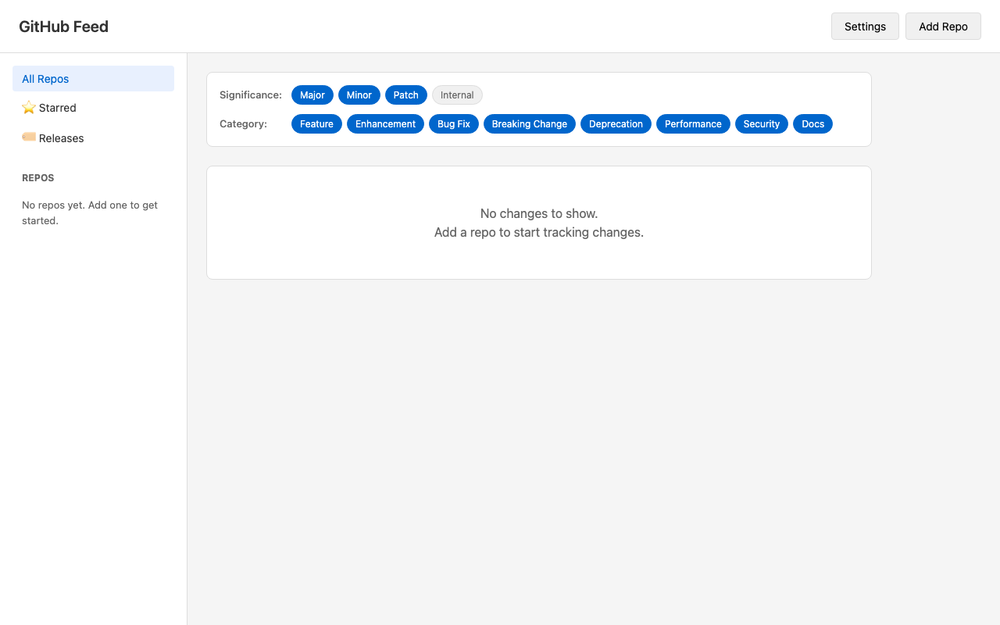

# GitHub Feed

**Stop missing important updates in the repos you care about.**

GitHub Feed monitors repositories and uses AI to surface what matters: new features, breaking changes, security fixes, and more—all in one unified feed.



## Why?

Watching GitHub repos gives you a firehose of commits. Release notes are often incomplete or delayed. GitHub Feed solves this by:

- **Analyzing merged PRs** with AI to extract meaningful changes
- **Classifying by impact** (major, minor, patch, internal) so you see what matters
- **Categorizing changes** (feature, bugfix, breaking, security, etc.)
- **Summarizing in plain English** with bullet points, not commit messages

Perfect for teams tracking dependencies, educators monitoring teaching materials, or anyone who needs to stay current with multiple repos.

## Features

| Feature | Description |
|---------|-------------|
| **Smart Classification** | AI categorizes each PR by type and significance |
| **Release Summaries** | AI-generated bullet points for release notes |
| **Unified Feed** | All repos in one chronological view |
| **Filtering** | Filter by significance (releases, major, minor, patch) and category |
| **Per-Repo Settings** | Custom colors, names, and feed preferences |
| **Starred Changes** | Save important updates for later |
| **Release Modal** | Click releases to view full rendered markdown notes |
| **New Badges** | Highlights unseen changes since your last visit |
| **Shared Indexing** | Repos indexed once, shared across all users for instant adds |
| **Auto-Refresh** | Fetches new PRs/releases on page load (hourly) |
| **Load Older Updates** | Fetch last 10 PRs for repos with no recent changes |

## Quick Start

1. **Set up environment variables** in `server/.env`:
   ```
   DATABASE_URL=postgresql://...
   GOOGLE_CLIENT_ID=your-google-client-id
   GOOGLE_CLIENT_SECRET=your-google-client-secret
   SESSION_SECRET=your-session-secret
   OPENAI_API_KEY=sk-...
   GITHUB_TOKEN=ghp_...
   ```

2. **Install & run:**
   ```bash
   npm install
   npm run dev
   ```

3. **Login with Google** and start adding repos

## Server Configuration

Add these API keys to your server `.env` file:

| Key | Purpose | Get it at |
|-----|---------|-----------|
| **OPENAI_API_KEY** | Classifies PR changes | [platform.openai.com](https://platform.openai.com/api-keys) |
| **GITHUB_TOKEN** | Higher rate limits (5k/hr vs 60/hr) | [github.com/settings/tokens](https://github.com/settings/tokens) |

> **Note:** GitHub tokens expire. Fine-grained tokens default to 30 days.

## Tech Stack

- **Frontend:** React + Vite + TypeScript
- **Backend:** Node.js + Express + TypeScript
- **Database:** PostgreSQL (Railway) + Prisma 7
- **Auth:** Google OAuth via Passport.js
- **APIs:** GitHub (Octokit), OpenAI (gpt-4o-mini)

## Planned features

- [x] Fix repo owner images not displaying
- [x] Persistent sessions (stay logged in across page reloads)
- [x] Shared indexing layer (repos indexed once, shared across users)
- [x] AI-generated release summaries
- [x] Clickable release cards with markdown modal
- [x] Repo avatars in sidebar
- [ ] Auto-mark items as seen on scroll + unread count badge ([spec](docs/auto-mark-seen-on-scroll.md))
- [ ] User profile page
- [ ] Show API usage to users
- [ ] Suggest already indexed repos when adding
- [ ] Background cron job for repo updates (currently on-demand)
- [ ] User repo semantic queries with questions like "When was support for guardrails added"?
- [ ] Stripe integration for paid plans
- [ ] When a user removes a repo from the sidebar, all FeedGroups should be automatically removed from their "all" feed as well

## License

MIT
